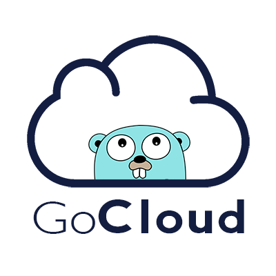
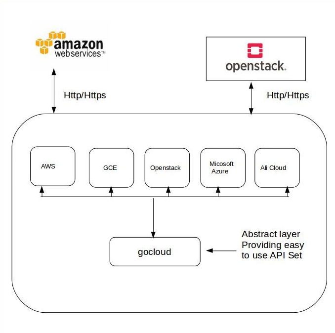

[](https://www.codacy.com/app/cloudlibz/gocloud?utm_source=github.com&utm_medium=referral&utm_content=cloudlibz/gocloud&utm_campaign=Badge_Grade)
[](https://travis-ci.org/cloudlibz/gocloud)
[](https://gitter.im/cloudlibz/gocloud)
[](docs)

# gocloud: Cloud services library.

GoCloud is a golang library which hides the difference between different APIs provided by varied cloud providers (AWS, GCP, OpenStack etc.) and allows you to manage different cloud resources through a unified and easy to use API.



## Service Types

**Compute** -- Allows you to manage cloud and virtual servers.

**Compute Storage** -- Allows you to manage Compute storage.

**Container** -- Allows users to install and deploy containers onto container based virtualization platforms.

**Load balancer** -- Allows you to manager Load Balancer service.

**DNS** -- Allows you to manage DNS service.

## Service Providers

### AWS

* EC2 Compute [Link to example](examples/compute/ec2/ec2.md)
* EC2 Storage [Link to example](examples/storage/aws_storage/aws_storage.md)
* Amazon Elastic Container Service (Container) [Link to example](examples/container/aws_container/aws_container.md)
* Elastic Load Balancing [Link to example](examples/loadbalancer/aws_loadbalancer/aws_loadbalancer.md)
* AWS Route53 (DNS) [Link to example](examples/dns/aws_route53/aws_route53.md)

### Google

* Google Compute [Link to example](examples/compute/gce/gce.md)
* Google Compute Storage [Link to example](examples/storage/google_storage/google_storage.md)
* Google Container Service (Container) [Link to example](examples/container/google_container/google_container.md)
* Google Elastic Load Balancing [Link to example](examples/loadbalancer/google_loadbalancer/google_loadbalancer.md)
* Google DNS [Link to example](examples/dns/google_dns/google_dns.md)

### DigitalOcean

* DigitalOcean Droplet [Link to example](examples/compute/droplet/droplet.md)
* DigitalOcean LoadBalancer [Link to example](examples/loadbalancer/digiocean_loadbalancer/digiocean_loadbalancer.md)
* DigitalOcean Storage [Link to example](examples/storage/digiocean_storage/digiocean_storage.md)
* DigitalOcean DNS [Link to example](examples/dns/digioceandns/digioceandns.md)

### Ali-cloud

* ECS Compute [Link to example](examples/compute/ecs/ecs.md)
* ECS Storage [Link to example](examples/storage/ali_storage/ali_storage.md)
* Alibaba Cloud DNS [Link to example](examples/dns/ali_dns/ali_dns.md)
* Server Load Balancer [Link to example](examples/loadbalancer/ali_loadbalancer/ali_loadbalancer.md)
* Container Service [Link to example](examples/container/ali_container/ali_container.md)

### Vultr

* Server [Link to example](examples/compute/vultr_compute/vultr_compute.md)
* Bare Metal [Link to example](examples/baremetal/vultr_baremetal/vultr_baremetal.md)
* Block Storage [Link to example](examples/storage/vultr_storage/vultr_storage.md)
* DNS [Link to example](examples/dns/vultr_dns/vultr_dns.md)

Currently, implementations for other cloud providers are being worked on.

## Installation instructions for Linux (Ubuntu)
1. Install golang->  
   ```
   $ sudo apt-get update -y
   $ sudo apt-get install golang -y
   ```

2. Set GOPATH environment variable. Run `gedit ~/.bashrc`.  
  Copy the following in your .bashrc file:
  ```
  export GOPATH=$HOME/gopath
  export GOBIN=$HOME/gopath/bin
  ```

3. Test your installation by copying the following piece of code in a file. Save the file as *gotest.go*. Run the file using the command `go run gotest.go`. If that command returns “Hello World!”, then Go is successfully installed and functional.
```golang
package main
import "fmt"
func main() {
    fmt.Printf("Hello World!\n")
}
```

4. Now we need to fetch the gocloud repository and other necessary packages. Run the following commands in order:
```
$ go get github.com/cloudlibz/gocloud
$ go get golang.org/x/oauth2
$ go get cloud.google.com/go/compute/metadata
```

5. Create a directory called .gocloud in your <b>HOME</b> directory. Download your AWS, Google and DigitalOcean access credentials and store them in a file in your .gocloud folder.

   #### AWS:
   Save your AWS credentials in a file named *amazoncloudconfig.json*.
   ```js
   {
     "AWSAccessKeyID": "xxxxxxxxxxxx",
     "AWSSecretKey": "xxxxxxxxxxxx"
   }
   ```
   #### Google Cloud Services:
   Save your Google Cloud credentials in a file named *googlecloudconfig.json*. The file is downloaded in the required format.
   #### DigitalOcean:
   Save your DigitalOcean credentials in a file named *digioceancloudconfig.json*.
   ```js
   {
     "DigiOceanAccessToken": "xxxxxxxxxxxx"
   }
   ```
   #### Ali-cloud:
   Save your Ali-cloud credentials in a file named *alicloudconfig.json*.
   ```js
   {
     "AliAccessKeyID":"xxxxxxxxxxxx",
     "AliAccessKeySecret":"xxxxxxxxxxxx"
   }
   ```
   #### Vultr:
   Save your Vultr credentials in a file named *vultrconfig.json*.
   ```
   {
     "VultrAPIKey":"xxxxxxxxxxxx"
   }
   ```

   You can also set your credentials as environment variables.  
   #### AWS:  
   ```
   export AWSAccessKeyID =  "xxxxxxxxxxxx"
   export AWSSecretKey = "xxxxxxxxxxxx"
   ```
   #### Google Cloud Services:
   ```
   export PrivateKey =  "xxxxxxxxxxxx"
   export Type =  "xxxxxxxxxxxx"
   export ProjectID = "xxxxxxxxxxxx"
   export PrivateKeyID = "xxxxxxxxxxxx"
   export ClientEmail = "xxxxxxxxxxxx"
   export ClientID = "xxxxxxxxxxxx"
   export AuthURI = "xxxxxxxxxxxx"
   export TokenURI = "xxxxxxxxxxxx"
   export AuthProviderX509CertURL = "xxxxxxxxxxxx"
   export ClientX509CertURL =  "xxxxxxxxxxxx"
   ```
   #### DigitalOcean:  
   ```
   export DigiOceanAccessToken =  "xxxxxxxxxxxx"
   ```
   #### Ali-cloud:
   ```
   export AliAccessKeyID =  "xxxxxxxxxxxx"
   export AliAccessKeySecret =  "xxxxxxxxxxxx"
   ```
   #### Vultr:
   ```
   export VultrAPIKey =  "xxxxxxxxxxxx"
   ```

6. You are all set to use gocloud! Check out the following YouTube videos for more information and usage examples:
https://youtu.be/4LxsAeoonlY?list=PLOdfztY25UNnxK_0KRRHSngJIyVLDKZxq&t=3

## Development setup

```
$ git clone https://github.com/cloudlibz/gocloud
$ cd gocloud
```

## Unit tests

```
$ cd gocloud
$ go test -v ./...
```

<b>Please make sure to delete all your instances, storage blocks, load balancers, containers, and DNS settings once you run the tests by visiting the respective web portals of the cloud providers.</b>
